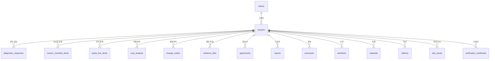

# SCHEMA.md — 체크인 DB 스키마

> 최종 업데이트: 2026-02-26
> 상태: 코드 대조 완료
> 범례: ✅ 구현됨 | 📋 미구현 | ⚠️ 설계와 다름

---

## 중요 GAP 요약

> [GAP] 설계 정본은 PostgreSQL + Prisma를 가정했으나, 실제 구현은 **Supabase** BaaS를 사용한다.
> - `users` 테이블 없음 → Supabase Auth가 users를 관리 (`auth.users`)
> - `checklists`/`checklist_items` 없음 → `diagnostic_responses`/`custom_checklist_items`
> - `photos`/`photo_metadata` 없음 → `evidence_files` + `files` (gallery)
> - `laws`/`law_checks` 없음 → DB 테이블 미구현 (설계 개념만 존재)
> - `risk_scores` 없음 → `projects.risk_score` 필드에 최신값만 저장, 이력 테이블 없음
> - `project_members` 없음 → 미구현
> - `notifications` 없음 → 미구현

---

## ERD (실제 구현 기준)

---

## 테이블 상세

### ⚠️ users → Supabase Auth 관리

> [GAP] 설계의 `users` 테이블은 Supabase가 `auth.users`로 내부 관리한다.
> 추가 사용자 데이터는 `user_settings` 테이블로 분리 저장.

---

### projects (프로젝트/현장) ✅

| 컬럼 | 타입 | 설명 |
|------|------|------|
| id | uuid | PK |
| user_id | uuid | FK → auth.users.id (소유자) |
| name | varchar | 프로젝트명 |
| type | varchar | 업종: cafe/restaurant/bar/… (43개) |
| address | varchar | 현장 주소 |
| budget | bigint | 예산 (원) |
| start_date | date | 공사 시작일 |
| end_date | date | 공사 예정 완료일 |
| actual_end_date | date | 실제 완료일 |
| status | varchar | planning/in_progress/completed/disputed |
| risk_score | integer | 최신 리스크 점수 (0~100) |
| risk_grade | varchar | safe/caution/warning/danger |
| progress_rate | decimal | 공정률 (%) |
| description | text | 설명 |
| created_at | timestamp | 생성일 |
| updated_at | timestamp | 수정일 |

> [GAP] 설계의 `latitude`/`longitude` 컬럼 코드에서 확인 안 됨.
> 설계의 `project_type` enum (cafe/residential/commercial/factory/office/other) 대신
> 실제로는 43개 업종 문자열을 직접 사용한다.

---

### diagnostic_responses (진단 체크리스트 응답) ✅

> [GAP] 설계의 `checklists` + `checklist_items` 2개 테이블 대신
> 이 단일 테이블이 체크리스트 응답을 저장한다.

| 컬럼 | 타입 | 설명 |
|------|------|------|
| id | uuid | PK |
| project_id | uuid | FK → projects.id |
| item_id | varchar | 체크리스트 항목 ID (예: cafe-safety-001) |
| checked | boolean | 체크 여부 |
| note | text | 비고 |
| created_at | timestamp | |
| updated_at | timestamp | |

---

### custom_checklist_items (커스텀 체크리스트 항목) ✅

| 컬럼 | 타입 | 설명 |
|------|------|------|
| id | uuid | PK |
| project_id | uuid | FK → projects.id |
| category | varchar | 카테고리 |
| item | varchar | 항목명 |
| checked | boolean | 체크 여부 |
| created_at | timestamp | |

---

### quote_line_items (견적 항목) ✅

| 컬럼 | 타입 | 설명 |
|------|------|------|
| id | uuid | PK |
| project_id | uuid | FK → projects.id |
| category | varchar | 공종 카테고리 |
| description | varchar | 항목 설명 |
| unit | varchar | 단위 |
| quantity | decimal | 수량 |
| unit_price | bigint | 단가 (원) |
| amount | bigint | 금액 (원) |
| note | text | 비고 |
| sort_order | integer | 정렬 |
| created_at | timestamp | |
| updated_at | timestamp | |

---

### cost_analysis (비용분석) ✅

| 컬럼 | 타입 | 설명 |
|------|------|------|
| id | uuid | PK |
| project_id | uuid | FK → projects.id (unique) |
| base_cost | bigint | 기본 비용 Cb |
| complexity_weight | decimal | 공사 복잡도 가중치 |
| timeline_weight | decimal | 공기 압박 가중치 |
| material_weight | decimal | 자재 변동 가중치 |
| labor_weight | decimal | 인건비 변동 가중치 |
| risk_weight | decimal | 리스크 프리미엄 가중치 |
| adjusted_cost | bigint | 조정 비용 |
| created_at | timestamp | |
| updated_at | timestamp | |

---

### change_orders (변경관리) ✅

| 컬럼 | 타입 | 설명 |
|------|------|------|
| id | uuid | PK |
| project_id | uuid | FK → projects.id |
| title | varchar | 변경 제목 |
| description | text | 변경 내용 |
| type | varchar | 변경 유형 |
| cost_impact | bigint | 비용 영향 |
| time_impact | integer | 일정 영향 (일) |
| status | varchar | pending/approved/rejected |
| requested_at | timestamp | |
| created_at | timestamp | |

---

### evidence_files (증빙 파일) ✅

> [GAP] 설계의 `photos` + `photo_metadata` 2개 테이블을 대체한다.
> 사진뿐 아니라 PDF/문서 등도 포함하므로 `evidence_files`로 명명.

| 컬럼 | 타입 | 설명 |
|------|------|------|
| id | uuid | PK |
| project_id | uuid | FK → projects.id |
| user_id | uuid | FK → auth.users.id |
| file_name | varchar | 파일명 |
| file_url | varchar | Supabase Storage URL |
| file_type | varchar | MIME 타입 |
| file_size | bigint | 파일 크기 |
| category | varchar | 공종 카테고리 |
| description | text | 설명 |
| sha256_hash | varchar(64) | SHA-256 해시 |
| merkle_root | varchar(64) | Merkle Tree 루트 |
| ai_check_result | jsonb | AI 분석 결과 (GO/NO-GO/CONDITIONAL) |
| created_at | timestamp | |

---

### agreements (3자 합의서) ✅

| 컬럼 | 타입 | 설명 |
|------|------|------|
| id | uuid | PK |
| project_id | uuid | FK → projects.id |
| content | text | 합의 내용 |
| total_amount | bigint | 합의 총액 |
| client_signed | boolean | 고객 서명 여부 |
| client_signature | text | 고객 서명 데이터 |
| contractor_signed | boolean | 시공사 서명 여부 |
| contractor_signature | text | 시공사 서명 데이터 |
| manager_signed | boolean | 현장소장 서명 여부 |
| manager_signature | text | 현장소장 서명 데이터 |
| status | varchar | pending/partial/completed |
| created_at | timestamp | |
| updated_at | timestamp | |

---

### reports (리포트) ✅

| 컬럼 | 타입 | 설명 |
|------|------|------|
| id | uuid | PK |
| project_id | uuid | FK → projects.id |
| user_id | uuid | FK → auth.users.id |
| type | varchar | daily/weekly/evidence_package |
| title | varchar | 리포트 제목 |
| content | text | AI 생성 내용 |
| date | date | 보고서 기준일 |
| created_at | timestamp | |

---

### processes (공정관리) ✅

| 컬럼 | 타입 | 설명 |
|------|------|------|
| id | uuid | PK |
| project_id | uuid | FK → projects.id |
| name | varchar | 공정명 |
| category | varchar | 공정 카테고리 |
| start_date | date | 시작일 |
| end_date | date | 종료일 |
| progress | integer | 진행률 (%) |
| status | varchar | pending/in_progress/completed/delayed |
| workers | integer | 투입 인원 |
| note | text | 비고 |
| created_at | timestamp | |
| updated_at | timestamp | |

---

### workforce (인력관리) ✅

| 컬럼 | 타입 | 설명 |
|------|------|------|
| id | uuid | PK |
| project_id | uuid | FK → projects.id |
| name | varchar | 근로자명 |
| role | varchar | 직종 |
| date | date | 근무일 |
| status | varchar | present/absent/half |
| hours | decimal | 근무 시간 |
| note | text | 비고 |
| created_at | timestamp | |

---

### materials (자재관리) ✅

| 컬럼 | 타입 | 설명 |
|------|------|------|
| id | uuid | PK |
| project_id | uuid | FK → projects.id |
| name | varchar | 자재명 |
| category | varchar | 자재 카테고리 |
| quantity | decimal | 수량 |
| unit | varchar | 단위 |
| unit_price | bigint | 단가 |
| supplier | varchar | 공급사 |
| status | varchar | pending/ordered/delivered |
| expected_date | date | 예상 도착일 |
| created_at | timestamp | |
| updated_at | timestamp | |

---

### clients (고객/업체) ✅

| 컬럼 | 타입 | 설명 |
|------|------|------|
| id | uuid | PK |
| user_id | uuid | FK → auth.users.id |
| name | varchar | 업체/고객명 |
| type | varchar | client/contractor/supplier |
| contact | varchar | 연락처 |
| email | varchar | 이메일 |
| address | varchar | 주소 |
| note | text | 메모 |
| created_at | timestamp | |

---

### user_settings (사용자 설정) ✅

| 컬럼 | 타입 | 설명 |
|------|------|------|
| id | uuid | PK |
| user_id | uuid | FK → auth.users.id (unique) |
| subscription_tier | varchar | free/pro/enterprise |
| notification_email | boolean | 이메일 알림 여부 |
| notification_kakao | boolean | 카카오 알림 여부 |
| theme | varchar | 테마 설정 |
| language | varchar | 언어 설정 |
| created_at | timestamp | |
| updated_at | timestamp | |

---

### verification_certificates (AI 검증 인증서) ✅

| 컬럼 | 타입 | 설명 |
|------|------|------|
| id | uuid | PK |
| project_id | uuid | FK → projects.id |
| user_id | uuid | FK → auth.users.id |
| code | varchar | 인증서 코드 (CHK-YYYY-XXXXX) |
| status | varchar | active/expired/revoked |
| total_score | integer | 총점 (0~100) |
| grade | varchar | A/B/C/D/F |
| cost_score | integer | 비용 점수 (0~25) |
| process_score | integer | 공정 점수 (0~25) |
| contract_score | integer | 계약 점수 (0~25) |
| schedule_score | integer | 일정 점수 (0~25) |
| score_details | jsonb | 점수 세부 내역 |
| issued_at | timestamp | 발급일 |
| expires_at | timestamp | 만료일 (+365일) |

---

### defects (하자관리) ✅ ⚠️ 설계에 없던 테이블

| 컬럼 | 타입 | 설명 |
|------|------|------|
| id | uuid | PK |
| project_id | uuid | FK → projects.id |
| title | varchar | 하자 제목 |
| description | text | 하자 내용 |
| severity | varchar | high/medium/low |
| location | varchar | 하자 위치 |
| status | varchar | reported/in_progress/resolved |
| photo_url | varchar | 사진 URL |
| created_at | timestamp | |
| updated_at | timestamp | |

---

### site_issues (현장 이슈) ✅ ⚠️ 설계에 없던 테이블

| 컬럼 | 타입 | 설명 |
|------|------|------|
| id | uuid | PK |
| project_id | uuid | FK → projects.id |
| type | varchar | 이슈 유형 |
| severity | varchar | 심각도 |
| description | text | 이슈 내용 |
| ai_classification | varchar | AI 분류 결과 |
| status | varchar | open/resolved |
| created_at | timestamp | |

---

### files (사진갤러리) ✅ ⚠️ 설계에 없던 테이블

| 컬럼 | 타입 | 설명 |
|------|------|------|
| id | uuid | PK |
| project_id | uuid | FK → projects.id |
| user_id | uuid | FK → auth.users.id |
| file_url | varchar | Supabase Storage URL |
| file_name | varchar | 파일명 |
| type | varchar | before/after/progress |
| ai_check_result | varchar | PASS/FAIL/UNCERTAIN |
| created_at | timestamp | |

---

## 신규 생성 테이블 (2026-02-26 추가) ✅

`supabase/migrations/20260226_add_law_engine_tables.sql` 실행 필요

| 테이블 | 설명 | 마이그레이션 상태 |
|--------|------|-----------------|
| `laws` | 12개 법령 마스터 | ✅ SQL 파일 준비 완료 |
| `law_checks` | 프로젝트별 법령 체크 결과 | ✅ SQL 파일 준비 완료 |
| `risk_scores` | 리스크 점수 이력 | ✅ SQL 파일 준비 완료 |
| `warranties` | 하자담보 | ✅ SQL 파일 준비 완료 |

시드 데이터: `supabase/migrations/20260226_seed_laws.sql` (12개 법령 INSERT)

## 미구현 테이블 (설계에만 존재) 📋

| 테이블 | 설명 | 이유 |
|--------|------|------|
| `project_members` | 멤버 초대/관리 | 다중 사용자 기능 미구현 |
| `notifications` | 알림 이력 | 알림 기능 미구현 |
| `subscriptions` | 구독/결제 이력 | 결제 연동 미구현 |
| `photo_metadata` | 사진 EXIF 메타데이터 | `evidence_files`에 통합 |

---

## 관련 문서
- [ARCHITECTURE.md](./ARCHITECTURE.md) — 시스템 구조
- [API_SPEC.md](./API_SPEC.md) — API에서 이 스키마 활용
- [BUSINESS_LOGIC.md](./BUSINESS_LOGIC.md) — risk_scores 계산 로직
